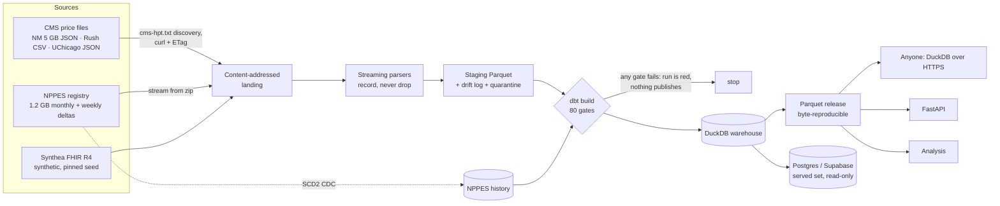

# clear-pricer — case study

**A cleaned, versioned, queryable view of public hospital price and provider data, with the reconciliation failures
published rather than hidden.** Built by Trevor J. Romack, 2026. Code: [github.com/tjromack/clear-pricer](https://github.com/tjromack/clear-pricer)
· Data: [releases](https://github.com/tjromack/clear-pricer/releases) · Analysis:
[Same code, different price](analysis/price-variation.md)

---

## The problem

Since 2021, US hospitals have been required to publish every price they charge as a machine-readable file (MRF).
Since 2024 the files must follow a CMS schema (v3.0.0 today). The data is public, mandated and practically unusable:
files run to gigabytes, conform to the schema unevenly, and put numbers in the same column that mean different
things. The NPPES registry of US providers is public too, but nothing connects the two.

clear-pricer ingests three Chicago hospitals' price files, the full NPPES registry and a synthetic FHIR R4 population.
It validates and reconciles them behind quality gates that fail the pipeline, and republishes a clean dataset.
Anyone can query it with no account.

## What it is



The same CLI steps run under **Airflow 3** (local, Docker) and a **GitHub Actions** schedule (hosted, daily):
`stage ×3 + nppes-sync + fhir-stage → build (gates) → publish → export → release`. DuckDB is the local engine and
Postgres the served one, and every publish is checked for parity between them.

| | |
|---|---|
| Charge rows published | **7,371,416** (3 hospitals) |
| Providers under change-data-capture | **9,825,970** NPIs, 9,855,257 versions |
| Synthetic FHIR resources parsed | **240,237** across 24 types; 1,200,521 of 1,200,521 references resolve |
| Quality gates | **80**, every one able to fail the run |
| Tests | **92** (unit + end-to-end gate tests), green on a fresh runner |
| Release | 13 Parquet files, **byte-identical** when built on a Linux runner and a Windows workstation |

## The spine: what the sources actually contained

The [schema-drift log](schema-drift-log.md) was written as each deviation was found, 21 entries. It's the most
useful artifact the project produced, and the rest of the design follows from it. The design rule was **record,
never drop**: every column, value or row the parsers couldn't map is kept and counted in a published conformance
table, `rpt_source_conformance`.

### Format: the files don't quite follow the format
- **A byte-order mark on JSON.** UChicago's file starts with one, which RFC 8259 forbids, so a strict parser rejects
  the whole 42 MB file. The parser strips it on every source and logs that it did.
- **Discovery files with scheme-less URLs.** Rush's `cms-hpt.txt` lists `apps.para-hcfs.com/...` with no `https://`.
  Discovery normalises it and logs the fix on every fetch.
- **A vendor endpoint with no size, date or ETag.** Rush's file is served by an ASPX endpoint, so change detection
  hashes the content. Where servers do send ETags (NM, UChicago), a 5 GB unchanged file costs one `304` request.

### Semantics: the same column means different things
- **CPT typed as HCPCS.** Two hospitals never use the `CPT` type. That's technically valid, since CPT *is* HCPCS
  Level I, but it's ambiguous. Northwestern types 1,037 HCPCS-shaped codes as `CPT`. The pipeline keeps the declared
  type and derives a `code_family` from each code's shape (CPT Cat I/II/III/PLA/MAAA, HCPCS II, CDT), and every
  comparison joins on that.
- **Medians over zero claims.** 92.8% of Northwestern's payer rows (6,523,094) report a median allowed amount with
  `count = "0"`, which the spec says not to encode. Those values are nulled in the clean columns, kept raw, and
  gated so they can never leak back.
- **Dollars that aren't negotiated prices.** 55.9% of Northwestern's dollar-plus-percentage rates don't reconcile
  with its own list price; 1.40M of them equal a zero-count median. Rush publishes 39,116 Medicare Advantage rates
  *at* the chargemaster price. Northwestern's fee-schedule dollars include $0.01 for a service listed at $1,361. Every
  price carries a `rate_basis` saying where its dollar came from.
- **Case packages under one code.** Northwestern prices 2,124 whole surgical cases as items carrying a single CPT
  code, so a $67,556 case can masquerade as a pathology exam.
- **No cash discount.** UChicago's cash price equals its list price on 100% of rows (Northwestern: 70% of list;
  Rush: 50%).

### The registry: NPPES is a moving target
- **Full files overlap their own boundary.** The September file "through 09/13" holds 46 records dated 09/14, and
  for one NPI it disagrees with the 09/14 weekly under the same date. The re-apply proof caught this. CDC now orders
  by the record's own date, then by the source file's coverage end.
- **Deactivations arrive as stubs.** They carry an NPI and a date with every other field blank. Taken as published,
  they'd erase the provider's history, so a deactivation carries the last known identity forward.
- **About 17% of weekly records change nothing** except update dates. The version hash excludes those dates, so no
  version is written.

### The generator: synthetic data needs checking too
- **Three reference forms.** In one Synthea dataset: bundle URNs, conditional identifier queries into *other*
  bundles, and `#contained` references. A resolver that knew only URNs reported 43,606 false "dangling" references.
- **Multi-threaded Synthea isn't byte-deterministic.** Two identical 16-core runs differed in one patient. Found by
  comparing a hosted release with a local one; generation is now pinned to one CPU.

## Decisions that shaped it

All 16 are in [DECISIONS.md](../DECISIONS.md), each with the rejected alternative. The ones that mattered most:

1. **Integrity gates fail; source findings are published** (CP-DEC 007). A missing required column, lost rows,
   quarantine above 1%, a broken reference or a non-synthetic patient turns the run red. A hospital's own spec
   deviations are measured and published, because a gate that failed on every publisher defect would never go green,
   and those deviations are the finding.
2. **The price is the dollar, labelled by origin** (CP-DEC 006), grounded in the CMS data dictionary: where a
   payer-specific dollar can be calculated, hospitals are to calculate and encode it. The M7 analysis added the second
   half (CP-DEC 015): for *comparisons*, methodology matters as much as the dollar.
3. **CDC, not truncate-and-reload** (CP-DEC 010). NPPES lands in a type-2 history, so a re-applied file changes
   nothing and a weekly delta touches only its own ~34k records.
4. **"Mapped" is measured, not declared** (CP-DEC 012). The FHIR parser records every field it reads, so the mapping
   report can't drift from the code. It shows ExplanationOfBenefit at 5.3% mapped: the payment detail is the obvious
   next extension.
5. **Reproducible means the same bytes on any machine** (CP-DEC 014). The release fingerprint hashes inputs and
   outputs; a release is cut exactly when the published data would change.
6. **Three read paths, sized to the job** (CP-DEC 013). Parquet on GitHub Releases for the full detail, Supabase's
   free tier for the small served set (row-level security, read-only), and FastAPI over the Parquet.

## Results

- **NPI reconciliation, both directions** ([results](results/npi-reconciliation.md)). All 8 Type-2 NPIs the price
  files disclose resolve and verify against NPPES: **0.0% unresolved**. In the other direction, NPPES holds 52 more
  active hospital NPIs registered under the same hospital names at the same addresses or campuses, for **13.3%
  disclosure coverage**. The candidates are published with their evidence and a threshold sensitivity band (46–65).
- **Price variation** ([analysis](analysis/price-variation.md)). The same outpatient service's list price differs a
  median **2.11×** across the three hospitals (2,323 codes). For insured patients, **who pays moves the price more
  than where they go**: inside UChicago the same service varies a median **4.06×** across payers, against a 1.55×
  typical gap between Rush and UChicago.
- **Synthetic FHIR** ([mapping](results/fhir-mapping.md)). Only 1.2% of synthetic claim lines (dental codes) share
  a code system with real price files. Clinical claims and billing prices barely share a vocabulary.

## What broke, and what it taught

The [build log](BUILD-LOG.md) records each break as it happened. The ones that changed the design:

- **Float cents.** Rush truncates derived dollars (61% × $2.14 → `1.30`) while the first rule rounded them, and in
  floating point `1.31 − 1.30 > 0.01`. 1,037 rows were mis-flagged. Reconciliation now compares within one cent of the
  exact product, with regression tests for truncation, rounding and a 2-cent miss.
- **Three idempotency bugs in the CDC.** Two were caught by reading the code before running it: a hash of a hash, and
  an older file tombstoning newer NPIs. The third was caught by the re-apply proof itself: NPPES publishing one NPI
  in two files under the same date. **A proof that can fail is worth more than one that is assumed.**
- **Views that baked in absolute paths.** A warehouse built inside the Airflow container broke on the host. It's
  now self-contained: tables only, no views over external paths.
- **A leaked password.** During setup, a failed connection test printed a database DSN, password included, because
  the driver echoes it. The password was rotated. Every connection now runs under a guard that redacts DSN passwords
  from errors, with a regression test for the exact case. The history was scanned clean before going public.
- **"Deterministic" on one machine.** Two builds on one workstation agreed. A hosted build didn't, in 3 of 13 files.
  Row-level diffs traced it to `any_value` thread scheduling, multi-threaded Synthea, and a ledger that included
  machine-specific proof runs. All three were fixed, and the fingerprints then matched across machines.
- **A plausible wrong answer.** The first cut of the analysis said Rush was the most expensive hospital on 398 of
  534 codes. Asking what kind of dollar each "negotiated rate" was exposed list-price Medicare Advantage rates, case
  packages and unit artifacts. The analysis now opens with a table of what each dollar actually is.

## How it's verified

- **Gates in the run, not beside it.** `dbt build` runs 80 tests that fail the run. A deliberately broken input
  turned the Airflow run red, publish never ran, and Postgres kept the previous build (run
  `broken_input_proof_1`). Three broken fixtures fail the run in CI on every push; each was verified to trip its
  intended gate.
- **Idempotency, proven.** Restaging a file gives byte-identical Parquet. Re-applying every NPPES file (9.87M
  records) left the 9,855,257-row history identical by fingerprint.
- **Parity.** Every publish checks counts, distinct keys and money sums between DuckDB and the served Postgres, and
  a mismatch fails the task.
- **Reproducibility across machines.** A GitHub runner and a workstation independently built release fingerprint
  `27a340045c24de0f…`. Every committed figure (NPI reconciliation, FHIR mapping, the analysis) regenerates
  byte-identically from a pinned release with one command.
- **A stranger's path.** A fresh container with no clone and no credentials queried the release over HTTPS,
  including the full 7.37M-row fact. CI does the clean-clone equivalent on every push.

## Limits

- **Three hospitals, one metro.** v1 is scoped to Northwestern Memorial, Rush and UChicago Medical Center; the
  analysis says "three Chicago hospitals", not "Chicago". v2 is 50+ hospitals.
- **Price files carry NPIs only in the header,** so the unresolved rate is over 8 NPIs. It becomes a meaningful rate
  at v2 scale.
- **No claims volumes.** Every code counts once in the analysis.
- **Northwestern's contracted prices aren't comparable** as published, so the contracted comparison is Rush vs
  UChicago.
- **FHIR is synthetic by construction** (a gate enforces it), so it demonstrates the path, not clinical findings.
- **Not modelled yet:** NPPES secondary practice locations, and FHIR ExplanationOfBenefit adjudication (the payment
  detail).
- **Hosting:** Supabase free tier (a 500 MB database, and projects pause without activity; the daily run is expected
  to keep it active). FastAPI isn't deployed to a public host.

## Try it

```python
import duckdb   # pip install duckdb
R = "https://github.com/tjromack/clear-pricer/releases/latest/download"
duckdb.sql(f"SELECT * FROM '{R}/rpt_npi_reconciliation.parquet'").show()
```

More paths (hosted REST, the API, clone-and-run) are in [QUERY.md](QUERY.md).

**Stack:** Python · DuckDB · dbt-core · Airflow 3 · Postgres / Supabase · FastAPI · Docker · GitHub Actions ·
pyarrow / ijson · Synthea. Public data and synthetic FHIR only; no PHI.
