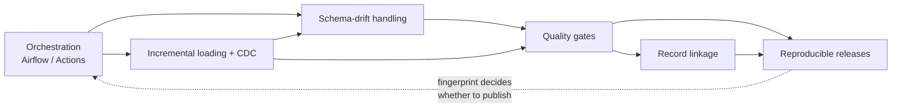
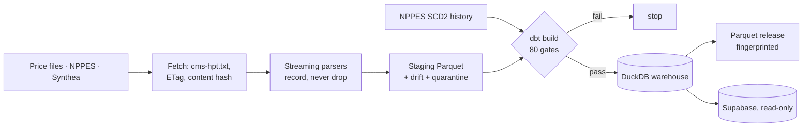

# clear-pricer — Project Explainer (study guide)

**A pipeline that turns US hospitals' legally required price files into a clean, queryable dataset, and publishes
everything the files got wrong.**

- **Status:** stable. v1 shipped 2026-09-29; all eight milestones are checked off, and v2 is defined as scale-out to
  50+ hospitals (src: `TODO.md`; `DECISIONS.md` CP-DEC 016). The hosted daily schedule is configured but, at the
  time of writing, every hosted run was started by hand (ran `gh run list --workflow pipeline.yml`: 3 runs, all
  `workflow_dispatch`).
- **Links:** repo [github.com/tjromack/clear-pricer](https://github.com/tjromack/clear-pricer) · data
  [releases](https://github.com/tjromack/clear-pricer/releases) · case study `docs/CASE-STUDY.md` · portfolio entry
  `tjromack-site/src/content/projects/clear-pricer.mdx`.
- **Written 2026-09-29 against commit `d218270`.**

## In one sentence

It downloads the price lists that hospitals must publish by law, turns three hospitals' very different files into
one tidy table, checks the hospitals' provider IDs against the national registry, and reports every place where a
hospital's own numbers don't hold together.

**Analogy:** a **customs inspector** for price lists. Every shipment (a hospital's file) is opened, checked against
the manifest (the federal format rules), repacked into a standard container, and anything odd is written up in a
public log. **Where it stops holding:** an inspector turns bad shipments away. This pipeline mostly doesn't. A
hospital's own mistakes are labelled and published, and the pipeline only stops itself when *its own* work would be
wrong.

**Built to learn:** data-quality gates · schema-drift handling · incremental loading and change-data-capture ·
record linkage / referential integrity · reproducible data releases · workflow orchestration.

---

# PART A — The concepts

## A1. Concept map

| Concept | Core / supporting | Where it lives | Depth reached |
|---|---|---|---|
| Data-quality gates | Core | `dbt/tests/*.sql` (17 singular tests), `dbt/models/**/_*.yml`, `dbt/dbt_project.yml` | **Applied**, close to production-shaped |
| Schema-drift handling ("record, never drop") | Core | `clear_pricer/parse_csv_tall.py`, `parse_json.py`, `normalise.py` (`DriftLog`), `docs/schema-drift-log.md` | **Applied** |
| Incremental loading & change-data-capture | Core | `clear_pricer/nppes.py` (`apply`), `fetch.py` (ETag + content addressing), `stage.py` | **Production-shaped** for correctness; Applied for operations |
| Record linkage / referential integrity | Core | `dbt/macros/reconcile.sql`, `dbt/models/marts/rpt_npi_*.sql` | **Applied** (deterministic, unevaluated threshold) |
| Reproducible data releases | Core | `clear_pricer/export.py`, `synthea.py` (`--cpus=1`), `report.py`, `analysis.py` | **Production-shaped** within its scope |
| Workflow orchestration | Core | `dags/clear_pricer_hpt.py`, `docker-compose.yml`, `.github/workflows/pipeline.yml` | **Applied** |
| dbt + DuckDB as the transformation engine | Supporting | `dbt/`, `clear_pricer/cli.py` (`dbt_build`) | Applied |
| Streaming parsing of huge files | Supporting | `parse_json.py` (ijson), `nppes.py` (pyarrow from zip) | Applied |
| Serving: Parquet, Postgres/Supabase, RLS, parity | Supporting | `publish.py`, `api.py` | Applied |
| FHIR R4 + synthetic data (Synthea) | Supporting | `fhir.py`, `synthea.py` | Introduced–Applied |
| Credential hygiene | Supporting | `secrets.py` | Applied |
| Comparable-price analysis | Supporting | `analysis.py`, `docs/analysis/` | Applied |

Depth scale: **Introduced** = used once or mostly via library defaults; **Applied** = implemented deliberately,
configured and tested; **Production-shaped** = handles the failure modes and operational concerns a professional
team would expect.



The arrows are how the concepts depend on each other here. Orchestration runs incremental loads and parsers; the
parsers' drift records feed the gates; the gates guard both linkage and the release; the release fingerprint loops
back to decide whether a scheduled run publishes anything.

## A2. The core concepts

### Concept 1 — Data-quality gates

**1. Plain language.** A quality gate is an automatic check that *stops the line* when something is wrong: a
smoke alarm wired to the conveyor belt, not just to a light on the wall. The key word is *stops*. A check that only
warns is a report; a check that fails the run is a gate.

**2. Why it exists.** Pipelines fail quietly. A join drops rows, a column changes meaning, an upstream file arrives
half-empty, and the dashboard still renders. Without gates, bad data reaches consumers and is discovered by the
person who trusted it. Gates move the failure to the moment it happens.

**3. How it works.** A *test* is a query that returns the rows violating a rule; zero rows means pass. In dbt,
*generic* tests (`unique`, `not_null`, `accepted_values`, `relationships`) are declared in YAML, and *singular* tests
are one-off SQL files ([dbt docs](https://docs.getdbt.com/docs/build/data-tests)). Each test has a *severity*: `error`
fails the command; `warn` only logs
([severity](https://docs.getdbt.com/reference/resource-configs/severity)). `dbt build` runs models and tests in
dependency order, and a failing test causes downstream resources to be skipped
([dbt build](https://docs.getdbt.com/reference/commands/build)).

**4. How this project uses it.** Every test is forced to `severity: error` at project level (src:
`dbt/dbt_project.yml`, `+severity: error`), and a run passes only with 80/80 (ran `clear-pricer run rush`:
`Done. PASS=80 WARN=0 ERROR=0`). The project splits checks into two classes (src: `DECISIONS.md` CP-DEC 007):
*integrity gates*, where the pipeline's own work would be wrong, fail the run; *source findings*, where a hospital's
file is wrong, are measured and published in `rpt_source_conformance`, not failed on. The central integrity gate:

```sql
-- dbt/tests/assert_no_rows_lost.sql
with published as (
    select hospital_id, count(*) as n from {{ ref('fct_standard_charges') }} group by 1
)
select f.hospital_id, f.records_read, f.charge_rows, f.quarantined_rows, coalesce(p.n, 0) as published_rows
from {{ ref('stg_hpt__files') }} f
left join published p using (hospital_id)
where f.records_read = 0
   or f.records_read <> f.charge_rows + f.quarantined_rows
   or f.charge_rows <> coalesce(p.n, 0)
```

Line by line: the parser counts every data record it read (`records_read`) and how each was disposed of (published
or quarantined). The test returns a hospital if the file was empty, if read ≠ published + quarantined (a row
vanished inside the parser), or if the staged count doesn't reach the final table (a row vanished in SQL). Returning
any row fails the build. Publishing is wired *downstream* of the gates in both schedulers (src:
`dags/clear_pricer_hpt.py`, `[*stages, nppes_sync, stage_fhir] >> gates >> publish`), so a red build can't publish.
This was demonstrated: a deliberately broken Rush file turned the Airflow run red, publish showed `upstream_failed`,
and Postgres kept its previous 7,371,416 rows (src: `docs/BUILD-LOG.md`, M2, run `broken_input_proof_1`). Three
broken fixtures are re-run in CI on every push (src: `tests/test_e2e_gates.py`).

**5. How professionals do it.** The same core: dbt tests at error severity in the build DAG. Teams usually add
`store_failures` so failing rows are saved to an audit table for triage
([dbt docs](https://docs.getdbt.com/docs/build/data-tests)); *model contracts*, which check column names and types
*before* a model builds ([contracts](https://docs.getdbt.com/docs/mesh/govern/model-contracts)); and
**write-audit-publish (WAP)**: write to a staging branch or snapshot, audit it, and publish atomically
(e.g. [Iceberg WAP](https://iceberg.apache.org/docs/1.8.0/spark-writes),
[lakeFS](https://lakefs.io/blog/how-to-implement-write-audit-publish/)). Dedicated tools, such as
[Great Expectations](https://docs.greatexpectations.io/docs/core/trigger_actions_based_on_results/create_a_checkpoint_with_actions)
and [Soda](https://docs.soda.io/soda-cl/metrics-and-checks.html), add alerting and data docs. **Comparison:** the
project's "gates, then publish via schema swap" is a hand-built WAP. The warehouse is written and audited, then a
single transaction swaps the served schema (src: `clear_pricer/publish.py`). It skips `store_failures`, contracts
and alerting.

**6. Depth reached: Applied, close to production-shaped.** The failure modes that matter are handled: silent row
loss, missing required columns, over-quarantine, broken references, unsafe types. Gates are tested to fail. **The
gap:** no failure-row storage for triage, no notification when a gate fires (a red run is noticed only by looking),
no freshness or volume-anomaly checks (e.g. "today's file is 40% smaller"), and no model contracts on published
tables.

**7. Common mistakes.** *Warn-only tests*: avoided (every test is error severity). *Tests run as a separate manual
step*: avoided (`dbt build` in the run). *Gates that fail on every upstream defect and so never go green*: avoided
deliberately by the integrity/findings split. *Tests that pass vacuously because they run before the tables exist*:
**encountered and fixed**. The Parquet-type gate read `information_schema` and could run early, so explicit
`depends_on` refs were added (src: `dbt/tests/assert_release_types_are_parquet_safe.sql`). *No proof the gate
fires*: avoided (broken fixtures in CI).

**8. Where it shows up elsewhere.** CI test gates in software, pre-trade risk checks in finance, release gates in ML
(an eval threshold that blocks deploy). The same pattern appears in the sibling `spancheck`, a RAG-evaluation
regression gate (src: `C:\ai\spancheck` README).

**9. To go deeper.** (a) Turn on `store_failures` and publish a "why the run failed" table. (b) Add a volume-anomaly
gate: fail when a hospital's row count moves more than N% from the last release. (c) Add dbt model contracts to the
release tables. Read: [dbt data tests](https://docs.getdbt.com/docs/build/data-tests),
[Iceberg WAP](https://iceberg.apache.org/docs/1.8.0/spark-writes).

**10. Check your understanding.**

- What's the difference between a check and a gate?
  <details><summary>Answer</summary>A gate fails the run and blocks what's downstream; a check only reports. Here every dbt test is error severity and publish depends on the gate task.</details>
- Why doesn't the pipeline fail when Northwestern reports medians over zero claims?
  <details><summary>Answer</summary>That's a source finding, not an integrity failure. It's measured and published; failing on it would keep the pipeline red forever. The integrity gate is that such medians never leak into the clean columns (`assert_no_zero_count_allowed_amounts.sql`).</details>
- What would break if `publish` were moved to run in parallel with `dbt_build_gates`?
  <details><summary>Answer</summary>A failing build could still publish, so Postgres/Supabase could serve ungated data. The WAP property depends on the dependency edge.</details>
- How is this project's publish step a form of write-audit-publish?
  <details><summary>Answer</summary>Tables are written to `published_new`, audited by the preceding gates and a parity check, and swapped into `published` in one transaction (`publish.py`).</details>
- Interview-hard: a test that reads `information_schema` passes on a clean build even though the bug exists. Why?
  <details><summary>Answer</summary>Without refs, dbt may schedule it before the tables are built, so it scans nothing. Declaring `-- depends_on: {{ ref(...) }}` forces the right order.</details>

---

### Concept 2 — Schema-drift handling: record, never drop

**1. Plain language.** *Schema drift* is when incoming data stops matching the shape you expected: a new column,
a renamed field, a number that arrives as text. *Record, never drop* means that when the parser meets something it
can't place, it keeps it, labels it and counts it, the way a mailroom keeps undeliverable letters in a labelled bin
instead of shredding them.

**2. Why it exists.** Real sources drift constantly. The three choices are *fail*, *evolve* (adapt the schema) or
*rescue* (keep the unfit data aside). Silently dropping is the one wrong answer, because nobody learns the source
changed.

**3. How it works.** An ingestion layer compares each record to an expected schema. Mapped fields go to typed
columns. Unmapped fields go to a side channel (a JSON column, a quarantine table, a dead-letter queue) with
provenance (which file, which row). Counters make the drift measurable, and a policy decides when drift is bad
enough to stop.

**4. How this project uses it.** The CSV parser is a generator that emits `charge`, `code` or `quarantine` events,
and counts everything it can't map in a `DriftLog`:

```python
# clear_pricer/parse_csv_tall.py -- CsvTallParse.events (excerpt)
for record_no, cells in enumerate(reader, start=4):  # file records 1-3 are headers
    loc = f"r{record_no}"
    if not any(c.strip() for c in cells):
        self.drift.add("blank_row", locator=loc)
        continue
    self.records_read += 1
    if len(cells) != len(header):
        self.drift.add("ragged_row", sample=f"{len(cells)} cells vs {len(header)}", locator=loc)
        yield "quarantine", {"source_locator": loc, "reason": "ragged_row",
                             "raw_json": json.dumps(cells, ensure_ascii=False)}
        continue
    yield "charge", self._charge(loc, cells, index)
```

Each record gets a *locator* (`r1234`) so any issue traces back to a file line. A row with the wrong number of cells
can't be mapped safely, so it goes to quarantine *with its raw cells*. Inside `_charge`, extra columns go to
`unmapped_json`, bad numbers are nulled and logged as `unparseable_numeric`, and invalid enum values as
`invalid_enum` (src: `parse_csv_tall.py`, `normalise.py`). The JSON parser does the same while streaming
(src: `parse_json.py`). The policy: a missing *required* column or an unknown template version fails the run, more
than 1% quarantined fails the run (src: `dbt/tests/assert_quarantine_within_tolerance.sql`), and everything else is
published per hospital in `rpt_source_conformance`. Separately, the human-readable `docs/schema-drift-log.md` holds
21 dated entries, written as each deviation was found (src: file, 21 rows). Examples: a UTF-8 BOM that makes
UChicago's JSON unparsable by strict parsers; `cms-hpt.txt` URLs with no scheme; CPT codes typed as HCPCS.

**5. How professionals do it.** The closest industry analogue is Databricks Auto Loader's `rescue` mode with a
`_rescued_data` column holding unparsed values plus the source path
([Databricks](https://docs.databricks.com/aws/en/ingestion/cloud-object-storage/auto-loader/schema)). Streaming
systems use schema registries with compatibility modes (BACKWARD, FORWARD, FULL)
([Confluent](https://docs.confluent.io/platform/current/schema-registry/fundamentals/schema-evolution.html)). Managed
connectors expose "propagate / approve / pause" policies
([Airbyte](https://docs.airbyte.com/platform/using-airbyte/schema-change-management)). Kafka Connect routes bad
records to a dead-letter queue with the error context in headers
([Confluent](https://www.confluent.io/blog/kafka-connect-deep-dive-error-handling-dead-letter-queues/)).
**Comparison:** the project's `unmapped_json` + quarantine + `DriftLog` is the rescue pattern built by hand, at
field granularity, with a tolerance policy. It skips a schema registry (not needed for file drops) and automated
alerting on *new* drift kinds.

**6. Depth reached: Applied.** Deliberate, tested (`tests/test_parse_csv_tall.py::test_drift_is_recorded_never_dropped`),
and policy-driven. **The gap:** drift is counted but not *diffed* over time (no "this hospital started a new kind of
error today" alert); the CSV "wide" layout isn't supported at all; and the policy is one global 1% threshold, not
per-source.

**7. Common mistakes.** *Dropping unmapped fields silently*: avoided. *Losing provenance*: avoided (locators, file
SHA-256). *Coercing bad values to zero*: avoided (null, raw kept). *Treating every drift as fatal*: avoided (findings
vs gates). *Only noticing drift when a dashboard breaks*: partly present, since there's no alert, only a published
table.

**8. Where it shows up elsewhere.** API integrations whose payloads change, log ingestion, EDI and claims files,
IoT telemetry, and scraping. The sibling `civic-request` uses a dead-letter queue and dbt drift tests (src: its
README).

**9. To go deeper.** (a) Store each release's drift counts and add a gate or alert on *new* `(hospital, kind)` pairs.
(b) Implement the CSV "wide" layout and let the drift log prove it. (c) Compare against Auto Loader's `rescue`
semantics on the same files. Read: [Databricks schema evolution](https://docs.databricks.com/aws/en/ingestion/cloud-object-storage/auto-loader/schema).

**10. Check your understanding.**

- Name the three responses to drift, and the one to avoid.
  <details><summary>Answer</summary>Fail, evolve, rescue. Avoid silent drop.</details>
- Why keep raw values next to cleaned ones?
  <details><summary>Answer</summary>So a cleaning rule can be audited or reversed. E.g. `median_amount_raw` is kept when `median_amount` is nulled for a zero-count row.</details>
- What would break if the parser coerced `"$12"` to `12.0` instead of nulling it?
  <details><summary>Answer</summary>The spec forbids currency symbols, so the source is non-conformant. Silently fixing it would hide that finding and trust a value the file didn't encode correctly.</details>
- Why is a ragged row quarantined rather than mapped best-effort?
  <details><summary>Answer</summary>With the wrong number of cells, column alignment is unknown, so any mapping could put a price in the wrong field.</details>
- Interview-hard: when should drift fail a pipeline rather than be recorded?
  <details><summary>Answer</summary>When the pipeline can no longer map faithfully: a missing required or key column, an unknown format version, or quarantine above tolerance. Otherwise record and publish.</details>

---

### Concept 3 — Incremental loading and change-data-capture (CDC)

**1. Plain language.** Instead of rebuilding everything from scratch each time, only process what changed, and keep
a history of *how* things changed. Like a library catalogue that records "this book moved shelves on Tuesday"
rather than reprinting the whole catalogue daily.

**2. Why it exists.** Full reloads are slow and expensive, and they erase history. With a monthly 11.7 GB registry
file, a truncate-and-reload loses the record of who changed what and when, and it makes re-runs risky.

**3. How it works.** *CDC* captures inserts, updates and deletes. *Log-based* CDC reads a database's write-ahead
log (e.g. [Debezium on Postgres](https://debezium.io/documentation/reference/connectors/postgresql.html)).
*Snapshot-diff* CDC compares each new full or delta file with current state. **SCD Type 2** ("slowly changing
dimension, type 2") stores every version of a record with effective and expiration dates and a current-row flag
([Kimball](https://www.kimballgroup.com/data-warehouse-business-intelligence-resources/kimball-techniques/dimensional-modeling-techniques/type-2/)).
**Idempotency**, where running the same step twice changes nothing, is the core discipline
([Airflow best practices](https://airflow.apache.org/docs/apache-airflow/stable/best-practices.html)).

**4. How this project uses it.** NPPES publishes a monthly full file plus weekly deltas. `nppes.apply` merges each
into an SCD2 `provider_history` (src: `clear_pricer/nppes.py`). The heart is the classification of each incoming
record:

```python
# clear_pricer/nppes.py -- apply(): classify each incoming record against the current version
SELECT *, CASE
    WHEN NOT existed THEN 'insert'
    WHEN cur_effective IS NOT NULL AND effective_date IS NOT NULL AND effective_date < cur_effective
         THEN 'stale'
    WHEN effective_date = cur_effective AND row_hash <> cur_hash AND cur_file_end IS NOT NULL
         AND ? < cur_file_end THEN 'stale'
    WHEN row_hash = cur_hash AND status = cur_status THEN 'unchanged'
    WHEN status = 'deactivated' AND cur_status <> 'deactivated' THEN 'deactivate'
    WHEN status = 'active' AND cur_status = 'deactivated' THEN 'reactivate'
    ELSE 'update' END AS change_type
```

Ordering uses the *record's own date* (latest of last-update, deactivation and reactivation), never arrival order.
An older record is `stale` and can't roll state back. A same-date conflict is broken by the source file's coverage
end, which was added after the re-apply proof caught NPPES publishing one NPI in two files under the same date with
different content (src: `docs/schema-drift-log.md`). `row_hash` excludes update and certification dates, so the
~17% of weekly records that only re-certify create no version. Deactivation "stubs" (an NPI and a date, all else
blank) carry the last known identity forward, and NPIs missing from a full file are tombstoned `absent_from_full`,
not deleted. Upstream of NPPES, `fetch.py` makes loads cheap and idempotent. Files are stored by content hash, and an
ETag `304 Not Modified` turns an unchanged 5 GB download into one request. Proof: re-applying every file (about 9.87M
records) left the 9,855,257-row history identical by fingerprint (src: `docs/BUILD-LOG.md`, M3). Unit tests cover
insert, update, stale, superseded, reactivation, absent-from-full and the boundary case (src:
`tests/test_nppes_cdc.py`, 10 functions).

**5. How professionals do it.** In dbt, *snapshots* implement SCD2 with `timestamp` or `check` strategies and
`hard_deletes` handling ([dbt snapshots](https://docs.getdbt.com/docs/build/snapshots)). dbt's docs call this
"batch-based CDC" and note that changes between runs are missed. Log-based CDC (Debezium) captures every change with
ordering from the log sequence number and emits tombstones for deletes. The "functional data engineering" school
treats tasks as pure, re-runnable functions over immutable partitions
([Beauchemin](https://maximebeauchemin.medium.com/functional-data-engineering-a-modern-paradigm-for-batch-data-processing-2327ec32c42a)).
**Comparison:** the project hand-writes what a dbt snapshot with a `check` strategy does, plus things snapshots
don't do by default: source-date ordering against late or out-of-order files, same-date tie-breaking, and stub
carry-forward. It skips log-based CDC (the source is files, so it doesn't apply).

**6. Depth reached: production-shaped for correctness; Applied for operations.** Late data, out-of-order files,
tombstones, idempotent re-application and a boundary quirk are all handled and tested. **The gap:** a single writer
with no locking (two concurrent syncs would race); hosted state lives in the GitHub Actions cache, which is not a
durable store, with a rebuild from currently listed files as the fallback (src: `pipeline.yml` comments); no compaction or
partitioning of a history that grows every week; no monitoring of delta sizes.

**7. Common mistakes.** *Ordering by arrival time*: avoided. *Truncate-and-reload labelled as incremental*: avoided.
*Treating a deactivation as a delete*: avoided (a new version, identity kept). *Hashing volatile fields such as
update dates*: avoided. *Re-applying an old full file and tombstoning newer records*: **encountered in review and
fixed**, with a regression test.

**8. Where it shows up elsewhere.** Customer and product master data, audit trails, slowly changing reference data
(prices, addresses), and replicating operational databases into warehouses.

**9. To go deeper.** (a) Re-implement the NPPES merge as a dbt snapshot and compare behaviours on the same files.
(b) Add a lock so two syncs can't run at once. (c) Partition `provider_history` by month and measure query speed.
Read: [dbt snapshots](https://docs.getdbt.com/docs/build/snapshots),
[Kimball Type 2](https://www.kimballgroup.com/data-warehouse-business-intelligence-resources/kimball-techniques/dimensional-modeling-techniques/type-2/).

**10. Check your understanding.**

- What makes a load *idempotent*?
  <details><summary>Answer</summary>Running it again with the same inputs yields the same state. Here, re-applying all NPPES files left the history fingerprint unchanged.</details>
- Why order by the record's date instead of the file's arrival?
  <details><summary>Answer</summary>Files can be re-run or arrive late; arrival order would let an old record overwrite a newer one.</details>
- What would break if `row_hash` included the Last Update Date?
  <details><summary>Answer</summary>Every re-certification (about 17% of weekly records) would create a spurious new version, and the history would stop meaning "real change".</details>
- Why carry identity forward on a deactivation stub?
  <details><summary>Answer</summary>The stub has blank fields; applying it as-is would erase who the provider was, which the reconciliation needs.</details>
- Interview-hard: snapshot-diff vs log-based CDC: which misses what?
  <details><summary>Answer</summary>Snapshot-diff misses intermediate changes between snapshots (a value that changed twice in a week shows once); log-based CDC captures each change but needs access to the source database's log.</details>

---

### Concept 4 — Record linkage and referential integrity

**1. Plain language.** *Referential integrity* asks: when one dataset points to something in another, does that
thing exist and match? *Record linkage* (or *entity resolution*) is deciding whether two records describe the same
real-world thing when there's no perfect shared key. Like matching guests to a reservation list when some
names are misspelled.

**2. Why it exists.** Data from different systems rarely agrees perfectly. Unresolved references produce wrong joins,
double counts or silent drops. Here, a hospital's price file lists its provider IDs (NPIs), and the national
registry should confirm them.

**3. How it works.** *Deterministic* linkage uses exact rules on keys. *Probabilistic* linkage (the Fellegi-Sunter
model) weighs partial agreement on several fields and sorts pairs into link / non-link / possible link, with a
review band ([Fellegi-Sunter](https://cs.cornell.edu/~shmat/courses/cs6434/fellegi-sunter.pdf);
[Splink's explanation](https://moj-analytical-services.github.io/splink/topic_guides/theory/fellegi_sunter.html)).
*Blocking* limits which pairs are compared. *String similarity* such as Jaro-Winkler scores near-matches in names.
Thresholds are chosen by measuring precision and recall on labelled pairs
([Splink QA](https://nbviewer.org/github/moj-analytical-services/splink_demos/blob/max_pair/07_Quality_assurance.ipynb)).

**4. How this project uses it.** Two directions (src: `DECISIONS.md` CP-DEC 011). **Resolution** is deterministic:
each disclosed NPI is checked for format, the Luhn check digit (the NPI standard's `80840` prefix), existence,
active status, organization type and hospital taxonomy, then for name similarity and address agreement (src:
`dbt/models/marts/rpt_npi_resolution.sql`; macro `npi_luhn_ok` in `dbt/macros/reconcile.sql`). **Completeness** is
fuzzy: it looks for active hospital registrations under the hospital's name near its addresses that the file
didn't list. Blocking is by the hospital's ZIP codes, and matching is a tiered rule:

```sql
-- dbt/models/marts/rpt_npi_completeness.sql (final select)
case when address_match and name_similarity >= 0.90 then 1   -- same street address + name
     when name_similarity >= 0.90 then 2                     -- same campus ZIP + name
     when address_match then 3                               -- same address, other name: shown, not counted
     else 4 end as tier                                      -- near-miss (0.80-0.90): sensitivity only
...
where address_match or name_similarity >= 0.80
```

Results: 8 of 8 disclosed NPIs resolve and verify (0.0% unresolved), and 52 undisclosed tier-1/2 candidates give a
disclosure coverage of 13.3%, with 46–65 across similarity thresholds 0.95/0.90/0.85 (src:
`docs/results/npi-reconciliation.md`). Gates check that every disclosed NPI gets exactly one resolution row and
every counted candidate satisfies the stated rule, and macro unit checks include the CMS check-digit example
`1234567893` (src: `dbt/tests/assert_npi_*.sql`, `assert_reconcile_macros.sql`).

**5. How professionals do it.** Practice layers deterministic keys first, then probabilistic scoring, then clerical
review for the uncertain band. Parameters are estimated (e.g. EM in [Splink](https://moj-analytical-services.github.io/splink/topic_guides/theory/fellegi_sunter.html))
and precision/recall are reported against labelled pairs. Tools: Splink, [dedupe](https://docs.dedupe.io/en/latest/how-it-works/Choosing-a-good-threshold.html)
(active learning), Zingg (Spark). **Comparison:** the project does the deterministic layer well. Its fuzzy layer is
a fixed Jaro-Winkler threshold with a *sensitivity table* instead of a *measured error rate*: there are no labelled
pairs, so precision and recall are unknown.

**6. Depth reached: Applied.** The deterministic checks are thorough, and the threshold was fixed before results were
seen and reported with sensitivity. **The gap:** no labelled ground truth; a single field weight (name) rather than
multi-field weighting; blocking only by disclosed ZIPs, which misses registrations elsewhere; NPPES secondary
practice locations not modelled; n = 8 disclosed NPIs, so the unresolved rate isn't statistically meaningful.

**7. Common mistakes.** *Tuning the threshold after seeing results*: avoided (fixed up front, stated). *Reporting a
single number without its sensitivity*: avoided. *Treating fuzzy matches as confirmed*: avoided ("candidates", with
evidence). *Never measuring precision/recall*: **present.** *Blocking so tightly that true matches are missed*:
present in a mild form, since Rush's disclosed address matched none of its own registrations and a campus tier was
needed.

**8. Where it shows up elsewhere.** Customer deduplication, KYC and anti-money-laundering, patient matching
(master patient index), merging supplier lists, and joining public datasets such as CMS and state licensing.

**9. To go deeper.** (a) Hand-label about 100 candidate pairs and compute precision/recall per threshold. (b) Run
Splink on the same NPPES slice with name, address and taxonomy comparisons and compare the results. (c) Model
secondary practice locations and measure how completeness changes. Read:
[Splink topic guides](https://moj-analytical-services.github.io/splink/topic_guides/theory/fellegi_sunter.html).

**10. Check your understanding.**

- Deterministic vs probabilistic linkage, in one line each?
  <details><summary>Answer</summary>Deterministic: exact rules on keys. Probabilistic: weighted evidence from partial agreement across fields, with a review band.</details>
- Why is a 0.0% unresolved rate weak evidence here?
  <details><summary>Answer</summary>It's 0 of 8. The completeness direction (52 candidates) carries the finding.</details>
- What would break if completeness blocked on exact street address only?
  <details><summary>Answer</summary>Rush would show zero candidates: its file lists 1620 W Harrison, where none of its 23 hospital registrations sit. The campus-ZIP tier exists for that.</details>
- What does a sensitivity table tell you that a single threshold doesn't?
  <details><summary>Answer</summary>How much the headline depends on the arbitrary cutoff: 46 to 65 candidates across 0.95–0.85.</details>
- Interview-hard: how would you estimate precision without labels?
  <details><summary>Answer</summary>You can't measure it without labels. EM-style models estimate match probabilities, but a professional result still validates against a labelled sample or clerical review.</details>

---

### Concept 5 — Reproducible data releases

**1. Plain language.** Same inputs → same output, byte for byte, on any machine. A published dataset is then like a
recipe that anyone can re-cook and check they got the identical dish.

**2. Why it exists.** Without reproducibility, a number can't be defended. You can't tell whether a difference came
from new data, a code change or randomness. Reproducible builds are defined as "any party can recreate bit-by-bit
identical copies" given the same source, environment and instructions
([reproducible-builds.org](https://reproducible-builds.org/docs/definition/)).

**3. How it works.** Remove every source of nondeterminism: timestamps, unordered output, thread scheduling, random
seeds, floating-point order, library versions. Then fingerprint the output (hash it) so equality is checkable, and
version releases by content.

**4. How this project uses it.** The export writes Parquet in a total order with a single thread, and fingerprints
inputs *and* outputs:

```python
# clear_pricer/export.py -- export()
con.sql("SET threads = 1")  # single-threaded writes: row groups (and so bytes) are deterministic
...
con.sql(f"COPY (SELECT * FROM main.{t} ORDER BY ALL) TO '{path.as_posix()}' "
        "(FORMAT parquet, COMPRESSION zstd, ROW_GROUP_SIZE 122880)")
...
fingerprint = hashlib.sha256(json.dumps({"inputs": ins, "outputs": [f["sha256"] for f in files]},
                                        sort_keys=True).encode()).hexdigest()
```

A release is cut only when the fingerprint changes (src: `export.release`). The claim was *tested across machines
and it failed first*. A GitHub Linux runner and a Windows workstation built different bytes in 3 of 13 files. The
causes: `any_value()` picking whichever row a thread reached first; Synthea, the synthetic-patient generator, being
non-deterministic when multi-threaded; and a ledger that included machine-specific proof runs. After fixes
(`min()`, Synthea pinned to `--cpus=1`, one ledger row per file), both built fingerprint `27a340045c24de0f…` (src:
`DECISIONS.md` CP-DEC 014; `docs/BUILD-LOG.md` M6). The committed results (`docs/results/`, `docs/analysis/`)
regenerate byte-identically from a pinned release (src: `tests/test_analysis.py::test_output_is_byte_reproducible`).

**5. How professionals do it.** Data versioning systems such as [DVC](https://doc.dvc.org/use-cases/versioning-data-and-models),
[lakeFS](https://lakefs.io/blog/how-to-implement-write-audit-publish/) and Delta/Iceberg time travel
([Delta](https://docs.delta.io/latest/delta-batch.html)) version data by content or snapshot. Order-sensitive
aggregates (`first`, `list`, `string_agg`) are made deterministic with explicit ordering, and float sums use
compensated summation where exactness matters
([DuckDB aggregates](https://duckdb.org/docs/current/sql/functions/aggregates.html)). Parquet files record the
writer and version in their metadata ([Arrow](https://arrow.apache.org/docs/python/generated/pyarrow.parquet.FileMetaData.html)),
so byte identity needs pinned writers. Many teams compare *logical* content hashes instead. **Comparison:** the
project goes further than most by demonstrating bit-identity across OSes, and it accepts float sums differing in the
11th digit between DuckDB and Postgres by using a 1e-9 relative tolerance in parity checks (src: `publish.py`).

**6. Depth reached: production-shaped within scope.** Nondeterminism was hunted down with evidence, and equality is
enforced by fingerprint. **The gap:** the host environment isn't fully pinned (`pyproject.toml` uses `>=` ranges;
only the Airflow image uses `requirements.lock`), so a future DuckDB release could change the bytes. There's no
content-addressed history of past releases beyond GitHub Releases, and no time-travel queries.

**7. Common mistakes.** *Checking determinism on one machine only*: **fell in, then fixed** (the M5 claim was
wrong and corrected in CP-DEC 014). *Order-dependent aggregates*: fell in (`any_value`), fixed. *Exact equality on
float sums across engines*: avoided (tolerance). *Timestamps embedded in outputs*: avoided (none in staging or
reports).

**8. Where it shows up elsewhere.** Build systems, ML experiment tracking, regulatory reporting, scientific data
publishing, and audit.

**9. To go deeper.** (a) Build from `requirements.lock` in CI and pin versions everywhere. (b) Add a CI job that
rebuilds from a fixed release and asserts the fingerprint. (c) Package releases as a Frictionless
[Data Package](https://specs.frictionlessdata.io/data-package/). Read:
[reproducible-builds definition](https://reproducible-builds.org/docs/definition/).

**10. Check your understanding.**

- Why fingerprint outputs as well as inputs?
  <details><summary>Answer</summary>A logic change can move a number with no new input data; hashing outputs makes that trigger a release.</details>
- Why did two runs on one machine agree but a second machine didn't?
  <details><summary>Answer</summary>Thread-count-dependent nondeterminism (16 vs 4 CPUs) only shows up when the scheduling changes.</details>
- What would break if `SET threads = 1` were removed from `export`?
  <details><summary>Answer</summary>Row groups could be written in different orders, changing bytes, and therefore the fingerprint, with no data change.</details>
- Why is `any_value` dangerous in a reproducible pipeline?
  <details><summary>Answer</summary>It returns an arbitrary row, which depends on execution order.</details>
- Interview-hard: byte identity vs logical identity: which should a data team require?
  <details><summary>Answer</summary>Logical identity (same rows) is usually enough and more portable. Byte identity is stronger and useful for fingerprinted releases, but it requires pinned writers and settings.</details>

---

### Concept 6 — Workflow orchestration

**1. Plain language.** An orchestrator is the conductor. It knows which steps exist, what order they run in, when
to start, what to retry, and what to do when one fails.

**2. Why it exists.** Scripts run by hand don't scale, don't retry, and don't record history. Orchestration adds
dependencies, schedules, retries, backfills and a run log.

**3. How it works.** In Airflow, a **DAG** (directed acyclic graph) of **tasks** is parsed by a **dag-processor**.
A **scheduler** creates **DAG runs** per data interval, and an **executor** (Local, Celery, Kubernetes) runs the
tasks. `catchup` controls whether missed intervals run
([Airflow DAG runs](https://airflow.apache.org/docs/apache-airflow/stable/core-concepts/dag-run.html)). Airflow 3
split out an API server and the dag-processor and moved task code to a Task SDK with no direct database access
([upgrade guide](https://airflow.apache.org/docs/apache-airflow/stable/installation/upgrading_to_airflow3.html)).

**4. How this project uses it.** One DAG runs three hospital stages, the NPPES sync and FHIR staging in parallel,
then the gates, then publish (src: `dags/clear_pricer_hpt.py`). Tasks are thin `BashOperator` calls to one CLI, so
the same steps run under Airflow locally and under GitHub Actions hosted (src: `DECISIONS.md` CP-DEC 009). Stage
tasks retry twice (network); gate and publish never retry. Per the code comment: "parse/validation problems are not
retried into silence". `catchup=False` and `max_active_runs=1` enforce one writer. A `source_overrides` param lets a
run be triggered with a broken file to prove the gate. The stack is Airflow 3.3.2 with LocalExecutor on Postgres 16
in Docker, with the pipeline in a separate virtualenv inside the image (src: `docker-compose.yml`,
`docker/Dockerfile.airflow`).

**5. How professionals do it.** Idempotent tasks, minimal top-level DAG code, credentials in Connections, alerting
on failure, and SLAs (Deadline Alerts in Airflow 3), with Celery or Kubernetes executors at scale
([best practices](https://airflow.apache.org/docs/apache-airflow/stable/best-practices.html)). Asset-based
orchestrators ([Dagster](https://docs.dagster.io/guides/build/assets)) model *data* rather than tasks. **Comparison:**
the project follows the idempotency and thin-task practices, but has no alerting, no deadlines or SLAs, credentials
in environment variables rather than Connections, and only LocalExecutor. The hosted schedule is a GitHub Actions
cron job, not an orchestrator.

**6. Depth reached: Applied.** A real DAG with retries, dependencies, a proven red run and two schedulers sharing
one CLI. **The gap:** no alerting (a red run is found by looking), no backfill use, no deadline alerts, no
multi-worker executor. And the hosted cron has never fired unattended: GitHub disables scheduled workflows in
public repos after 60 days without repository activity
([GitHub docs](https://docs.github.com/en/actions/reference/workflows-and-actions/events-that-trigger-workflows)), a
real risk for a finished project.

**7. Common mistakes.** *Non-idempotent tasks*: avoided. *Heavy logic in DAG files*: avoided (thin wrappers).
*Retrying deterministic failures*: avoided (the gate never retries). *Assuming a scheduled job runs*: **present**
(unverified, plus the 60-day inactivity rule).

**8. Where it shows up elsewhere.** ML training pipelines, ETL, report generation, infrastructure jobs. Sibling
`nba-parquet` uses Airflow 2.9 (src: its README).

**9. To go deeper.** (a) Add failure alerts (an email or Slack callback) and a Deadline Alert. (b) Model the
pipeline as Dagster assets and compare. (c) Add a keep-alive or health check for the GitHub schedule. Read:
[Airflow best practices](https://airflow.apache.org/docs/apache-airflow/stable/best-practices.html).

**10. Check your understanding.**

- Why do the gate and publish tasks have `retries=0`?
  <details><summary>Answer</summary>Their failures are deterministic (bad data or bad logic); retrying wastes time or, worse, hides a flaky pass.</details>
- What does `catchup=False` prevent here?
  <details><summary>Answer</summary>A burst of back-dated runs when the stack restarts after days off.</details>
- What would break if `max_active_runs` were raised to 3?
  <details><summary>Answer</summary>Concurrent runs would race on the DuckDB warehouse and the NPPES state DB, which are single-writer.</details>
- Why keep one CLI under two schedulers?
  <details><summary>Answer</summary>So there's one pipeline, and a run under Airflow and a run under Actions can't drift apart.</details>
- Interview-hard: is a GitHub Actions cron an orchestrator?
  <details><summary>Answer</summary>No. It's a scheduler for one linear job, with no dependency graph across runs, backfill or run history of data intervals. It's fine for one daily job.</details>

## A3. Supporting concepts

- **dbt + DuckDB.** dbt compiles SQL models into tables and runs tests; DuckDB is an in-process analytical
  database, so the whole warehouse is one file and needs no server (src: `dbt/profiles.yml`). Worth studying:
  dbt is the default transformation tool in modern data teams.
- **Streaming parsing.** Northwestern's 5.02 GB JSON is parsed one item at a time with `ijson`, and NPPES's 11.7 GB
  CSV is streamed out of its zip with pyarrow, keeping 51 of 330 columns in 57 s (src: `parse_json.py`, `nppes.py`,
  `docs/BUILD-LOG.md` M3). Worth studying for any large-file ingestion.
- **Serving and security.** Supabase serves 11 small tables read-only. Row-level security, a SELECT-only policy and
  grants are re-applied inside every schema swap, matching Supabase's guidance that exposed tables need RLS
  ([Supabase RLS](https://supabase.com/docs/guides/database/postgres/row-level-security)); a write with the public
  key returned 401 (src: `docs/BUILD-LOG.md` M6). Parity checks compare DuckDB and Postgres after each publish.
- **FHIR and Synthea.** FHIR R4 is the healthcare interchange standard; Synthea generates synthetic patients from a
  seed ([Synthea wiki](https://github.com/synthetichealth/synthea/wiki/Basic-Setup-and-Running)). The parser measures
  mapping coverage by *read-tracking* (a field counts as mapped only if code read it), validates structure and every
  reference, and a gate fails the run on any non-synthetic patient (src: `fhir.py`,
  `dbt/tests/assert_fhir_synthetic_only.sql`). Validation is structural, not the HL7 profile validator. Introduced
  to Applied.
- **Credential hygiene.** A redaction guard strips DSN passwords from driver errors after a real leak during setup
  (src: `secrets.py`, `tests/test_secrets.py`). Small, but a good habit to talk about.
- **Comparable-price analysis.** Defining what "the same price" means before comparing (src: CP-DEC 015). This is
  analytics-engineering judgment, worth studying alongside the data work.

## A4. What the concepts add up to

Separately, each concept is a known pattern. Together they produce something none gives alone: **a dataset whose
every number is defensible**. Drift handling guarantees nothing was silently lost; gates guarantee the pipeline's own
work is sound before anyone sees it; CDC guarantees re-runs are safe; linkage turns two public datasets into a
finding; reproducibility means anyone can rebuild the same bytes; orchestration runs it unattended.

**TJ can credibly say** he understands, from having built and broken them:
- quality gates that fail the build, and how to separate integrity failures from source findings;
- rescue-style drift handling with provenance;
- SCD2 CDC with out-of-order data and idempotency proofs;
- deterministic reconciliation with sensitivity reporting;
- chasing nondeterminism down to byte-reproducibility;
- a working Airflow 3 DAG.

**He should not yet claim:**
- production operations (alerting, on-call, SLAs);
- probabilistic entity resolution with measured precision and recall;
- log-based CDC;
- distributed processing at scale;
- validated FHIR implementation.

---

# PART B — Everything else

## B1. The real-world problem

**Who has it.** Journalists (the New York Times' 2021 analysis showed one MRI priced at $1,019 under Cigna and
$3,809 under Humana at the same hospital; [Advisory Board](https://advisory.com/daily-briefing/2021/08/24/hospital-prices)).
Health-policy researchers ([KFF](https://www.kff.org/health-costs/analysis-inconsistencies-within-hospital-price-transparency-data-make-cost-comparisons-difficult/)).
Employers and benefits consultants benchmarking network costs
([Milliman](https://www.milliman.com/en/insight/price-transparency-opportunities-for-employers)). Providers and
payers in contract negotiations, and device and life-sciences market-access teams
([Turquoise Health](https://turquoise.health/)).

**Why it exists.** The Hospital Price Transparency rule (45 CFR 180) took effect 1 January 2021, requiring a
machine-readable file of all standard charges
([CMS](https://www.cms.gov/priorities/key-initiatives/hospital-price-transparency)). A standard template became
mandatory from 1 July 2024 ([Forvis](https://www.forvis.com/forsights/2023/12/cms-price-transparency-update)). For
2026, CMS replaced estimated amounts with median, 10th and 90th percentile allowed amounts and a count, and required
Type-2 NPIs ([CMS fact sheet](https://www.cms.gov/newsroom/fact-sheets/cy-2026-opps-ambulatory-surgical-center-final-rule-hospital-price-transparency-policy-changes)).
The rule mandated publication, not usability. GAO found CMS has no assurance the data is complete or accurate
([GAO-25-106995](https://www.gao.gov/products/GAO-25-106995)). HHS OIG estimated about 46% of hospitals didn't meet
the standard-charge requirements ([OIG, Nov 2024](https://oig.hhs.gov/reports/all/2024/not-all-selected-hospitals-complied-with-the-hospital-price-transparency-rule)).
KFF called the data "messy, inconsistent and confusing"
([KFF](https://www.kff.org/health-costs/analysis-inconsistencies-within-hospital-price-transparency-data-make-cost-comparisons-difficult/)).

**What people do today.** They buy cleaned data from vendors (Turquoise Health, Serif Health, Payerset), use free
aggregations (Trilliant Health's 2025 release of 5B+ rates from 5,000+ hospitals;
[Trilliant](https://www.trillianthealth.com/press/centralized-price-transparency-mrfs)), use community datasets
(DoltHub's 2021 bounty collected 72.7M prices from about 1,400 hospitals;
[DoltHub](https://dolthub.com/blog/2021-01-14-hopsital-prices-bounty)), or write in-house parsers.

**The cost.** **Inference:** mostly the cost of wrong comparisons. This project's own first analysis ranked Rush
most expensive on 398 of 534 codes, an artifact of 39,116 rates published at the list price (src:
`docs/BUILD-LOG.md` M7). Trilliant describes "a cottage industry … charging substantial fees for access to data
that's supposed to be public" ([Trilliant](https://www.trillianthealth.com/press/centralized-price-transparency-mrfs)).

**Before and after.** *Before:* three incompatible files (a 5 GB JSON, a CSV, a JSON with a stray byte-order mark)
and a "negotiated rate" column that means five different things. *After:* one query over a labelled table, plus a
published list of what each hospital got wrong.

## B2. The landscape

| Tool / vendor | What it does | What it does better | What clear-pricer does differently |
|---|---|---|---|
| [Turquoise Health](https://turquoise.health/) | Commercial rate data, contracting and compliance tools | Scale (billions of rates, hundreds of payers), products, support | Open, reproducible, publishes per-hospital conformance findings |
| [Serif Health](https://serifhealth.com/platform/data/coverage-and-methodology) | Transparency-in-Coverage payer data, NPI/EIN mapping, delivered as Parquet or Snowflake | Payer-side coverage; removes "ghost" rates using claims | Hospital-side; no claims; methodology is in the open |
| [Trilliant Health](https://www.trillianthealth.com/press/centralized-price-transparency-mrfs) | Free centralized hospital MRF dataset | Coverage (5,000+ hospitals) | Gates, drift log, byte-reproducible releases |
| [CMS hpt-validator](https://github.com/CMSgov/hpt-validator) | Official validator for MRF format | Authoritative on schema validity | Goes past validity to *semantic* checks (dollars that aren't prices) and reconciliation |
| [DoltHub dataset](https://www.dolthub.com/blog/2025-01-28-state-of-hospital-price-transparency-data/) | Versioned open database of hospital prices (bounties ended 2023) | Git-style data versioning, community scale | Current (2026) files, v3 template, quality gates |

**Where it fits: a learning-scale version of a real category, with one distinctive angle.** The vendors win on
coverage by orders of magnitude. The distinctive angle is methodological: conformance findings as a published
product, labelled price semantics, and byte-reproducible releases. That's genuinely rare, but not a market gap for a
three-hospital tool.

## B3. How it could be used today

1. **A health reporter comparing three Chicago hospitals:** query `agg_code_prices` with `rate_basis = 'dollar'`
   for a procedure, and get defensible like-for-like numbers. *Still needs:* more hospitals, and legal review of
   claims.
2. **An analyst evaluating a hospital's file quality:** read `rpt_source_conformance` to see its zero-count medians,
   unreconciled rates and code typing. *Still needs:* the CSV "wide" layout and more hospitals.
3. **A data-engineering hiring panel:** clone it, run `clear-pricer run rush`, and break it with the provided
   fixture to watch the gate fire. *Needs nothing more.*
4. **A teaching example:** SCD2, drift and reproducibility, each with tests and a real dataset.

**Fastest way to see it:** `pip install duckdb`, then run the three-line snippet in `docs/QUERY.md`. It returned the
four-row reconciliation table in about 1 s (ran it on 2026-09-29). To run the pipeline: Python 3.11+ and `curl`,
then `pip install -e ".[dev]"` and `clear-pricer run rush`. **Ran on 2026-09-29:** 69,013,318 bytes fetched,
208,409 rows staged, 0 quarantined, `Done. PASS=80`, `[gate] PASS`, in 21 s wall (15 s on an earlier run). A
failure prints `[gate]  FAIL` and exits non-zero. **New data:** add a hospital to `clear_pricer/sources.py` (the
site hosting its `cms-hpt.txt` and its location name); CSV tall and JSON v3.0.0 are supported. **Who shouldn't use
it:** anyone needing national coverage (use a vendor or Trilliant's free data), payer-side TiC data (Serif), or
patient cost estimates.

## B4. How it works end to end



**Worked example** (src: `tests/fixtures/rush_sample.csv`, first data row). A Rush pharmacy item has list price
$2.14; payer "AETNA COMM - ALL OTHER PLANS"; percentage 54.40; dollar $1.16; median allowed $248.52; count 3048.
- *Drift handling* maps every column (none unmapped) and assigns locator `r4`.
- The rate rule checks 54.40% × $2.14 = $1.164, within a cent of $1.16, so `rate_basis = dollar_from_percent`
  (src: `rules.resolve_rate`).
- The count is 3,048, not 0, so the median stays in the clean column. The test asserts
  `count_bucket == "11+"` and `count_n == 3048` (src: `tests/test_parse_csv_tall.py`).
- The code `1501010` is typed `CDM`, so it gets no `code_family`.
- *Gates* then confirm the row reached the fact table (`assert_no_rows_lost`) and that its `rate_basis` is
  consistent (`assert_rate_basis_consistent`).
- *Reproducibility* writes it in total order into the release.
- In the M7 analysis it's excluded from contracted comparisons, because it isn't a fee-schedule dollar.

**AI vs deterministic code.** No model is used anywhere (src: dependency manifests contain no AI libraries). Name
matching uses a fixed formula, prices use rules quoted from the CMS dictionary, and outputs are byte-reproducible.
**Inference:** a model would break the reproducibility and auditability that are the project's point.

## B5. Why it's designed this way

> **Airflow over Dagster.** Reason: résumé recognition (src: `CLAUDE.md` Stack). · **Trade-off:** task-centric, not
> asset-aware. · **Would switch if:** data lineage mattered more than recognition. *A learning/career choice, and
> legitimate.*

> **DuckDB local + Postgres served.** Reason: a stranger runs everything with no cloud credentials (src: `CLAUDE.md`
> pin 5). · **Trade-off:** two engines, so parity checks are needed. · **Would switch if:** a single cloud warehouse
> were acceptable.

> **Hand-written parsers over DuckDB's `read_csv`.** Reason: per-field drift logging and row quarantine, and
> unit-testable spec rules (src: CP-DEC 007). · **Trade-off:** more code to maintain. · **Would switch if:** a reader
> offered rescue-column semantics.

> **SCD2 by hand over dbt snapshots.** **Likely:** to learn CDC mechanics, and because the needed ordering
> (source-date plus file-coverage tie-break, stub carry-forward) isn't snapshot-default (basis: CP-DEC 010 lists
> these rules). · **Trade-off:** custom code. · **Would switch if:** maintaining it cost more than adapting
> snapshots.

> **Gates fail; findings publish.** Reason: a gate failing on publisher defects never goes green (src: CP-DEC 007). ·
> **Trade-off:** a bad source *finding* never pages anyone. · **Would switch if:** consumers needed alerts on source
> regressions.

> **Parquet release + Supabase free tier over Supabase Pro.** Reason: files serve detail better; $0 (src: CP-DEC
> 013). · **Trade-off:** the free tier pauses when inactive. · **Would switch if:** demos needed an always-on API.

> **GitHub Actions over managed Airflow for hosting.** Reason: $0 against several hundred dollars a month (src:
> CP-DEC 009). · **Trade-off:** no orchestration features; schedules can be disabled after 60 days of inactivity. ·
> **Would switch if:** there were several interdependent pipelines.

> **Three hospitals, depth before breadth.** Reason: "cut hospitals, not verification" (src: CP-DEC 002). ·
> **Trade-off:** thin statistics. · **Would switch if:** the gates were stable (they now are; v2).

## B6. Why this project exists

**Inference, from the milestone order and `CLAUDE.md`:** it was built to learn a production data-engineering loop:
ingest messy sources, gate quality, do CDC, reconcile, and publish reproducibly. Hospital price files are an ideal
vehicle because they are public (no PHI or legal risk), huge (real scale problems), and non-conformant in
documented ways (real drift to handle). NPPES adds a genuine CDC use case. The repo calls itself "BUILD 2" of a
portfolio slate, the "data-engineering pillar", kept outside an AI/LLM workspace (src: `DECISIONS.md` CP-DEC 001).
The history (20 commits over 2026-09-28 to 2026-09-29; `git log`) shows decisions written before code, one
milestone per commit, and several course corrections recorded rather than hidden: M4 was reframed when NPIs turned
out to be header-only; CP-DEC 014 corrects CP-DEC 012; and M7's first analysis was discarded.

## B7. How it's verified

| Failure caught | Mechanism | Source |
|---|---|---|
| Silent row loss, missing columns, over-quarantine, wrong template | dbt integrity gates | `dbt/tests/assert_no_rows_lost.sql` etc. |
| Spec-rule errors (rates, medians, code families, cents) | Unit tests | `tests/test_rules.py` |
| Dropped or unmapped fields | Parser tests | `tests/test_parse_*.py` |
| CDC regressions (stale, boundary, stubs, tombstones) | Unit tests on synthetic zips | `tests/test_nppes_cdc.py` |
| A gate that doesn't fire | Broken fixtures in CI | `tests/test_e2e_gates.py`, `tests/test_fhir.py` |
| Non-synthetic patient / dangling reference | dbt gates + end-to-end tests | `assert_fhir_synthetic_only.sql` |
| Served DB drifting from warehouse | Parity check per publish | `clear_pricer/publish.py` |
| Nondeterminism | Byte-reproducibility tests; cross-machine fingerprint | `tests/test_analysis.py`, CP-DEC 014 |
| Credential leaks in errors | Redaction tests | `tests/test_secrets.py` |

**Headline numbers:**
- **92 tests pass** (ran `pytest -q`: 92 passed in 22.5 s). The spec rules, parsers, CDC and gates are exercised on
  every push.
- **80 dbt gates** (ran `clear-pricer run rush`: `PASS=80`). Eighty separate ways the run can refuse to publish.
- **0.0% unresolved, 13.3% disclosure coverage** (src: `docs/results/npi-reconciliation.md`). The hospitals' listed
  NPIs are all real, but they list only about 1 in 7 of the matching hospital registrations.
- **List price median 2.11×; UChicago payer spread 4.06× vs 1.55× between hospitals** (src:
  `docs/analysis/price-variation.md`). The same outpatient service's list price roughly doubles from the cheapest to
  the dearest hospital, and at UChicago, which insurer you have moves the price more than which hospital you choose.
- **Fingerprint `27a340045c24de0f…` on two machines** (src: CP-DEC 014). Anyone rebuilding from the same inputs gets
  identical files.

**Not covered:** the unattended schedule, alerting, load or performance tests, CSV "wide" files, precision and
recall of the fuzzy matching, and FHIR profile validation.

## B8. Where it breaks

**Known failures, all fixed and regression-tested** (src: `docs/BUILD-LOG.md`):
- float-cent comparison mis-flagged 1,037 truncated dollars;
- three CDC idempotency bugs;
- views baked absolute paths into the warehouse;
- multi-threaded nondeterminism;
- a misleading first analysis.

**What would break it now:**
- a new template version (fails by design);
- CSV "wide" files (unsupported);
- 50 hospitals at single-process speed (Northwestern alone takes about 3 minutes);
- a hospital dropping its `cms-hpt.txt`;
- two concurrent NPPES syncs;
- the GitHub schedule being disabled by inactivity;
- the free-tier Supabase project pausing.

**Weaknesses:**
- n = 8 NPIs;
- Northwestern's contracted prices unusable;
- FHIR synthetic and only 5.3% of ExplanationOfBenefit mapped;
- no labelled linkage data;
- partially pinned dependencies.

**Claims not supported:** national or metro-wide prices; what patients pay; production-scale throughput;
statistically meaningful NPI rates; validated FHIR; compliance findings (the candidates are evidence, not
violations).

## B9. What transfers

**Techniques that carry over, by Part A concept:**
- **Gates:** separating integrity gates from findings, and publishing only through a transaction after the audit.
- **Drift handling:** rescue with provenance.
- **CDC:** source-ordered SCD2 with idempotency proofs.
- **Linkage:** tiered deterministic matching with sensitivity bands.
- **Reproducibility:** fingerprinting inputs plus outputs.
- **Orchestration:** one CLI shared by two schedulers.

**Strongest evidence for data engineering**, then analytics engineering. It's weak evidence for applied AI: no
model is used.

**Candidate `demonstrates`:** `Gates that fail bad runs, and releases that rebuild byte-identical on any machine`

## B10. How it fits the portfolio

(src: sibling READMEs in `C:\dev` and `C:\ai`)

**Shared concepts:**
- **Quality gates** appear in nba-parquet (`etl/quality.py`), civic-request (dbt tests), and spancheck and the
  eval harness (CI regression gates). It's the portfolio's most repeated idea.
- **Idempotent loads** appear in nba-parquet (partition overwrite) and civic-request (MERGE).
- **dbt + DuckDB** also appears in civic-request.
- **Airflow and Parquet** also appear in nba-parquet.

**Only here:**
- SCD2 change-data-capture;
- true record linkage;
- a byte-reproducible cross-machine release;
- FHIR and Synthea.

**Learning gaps worth noticing.** Quality gates appear in four or five projects, but **no project takes them past
Applied**: none adds alerting, failure storage or anomaly detection. **Orchestration** is Applied in both Airflow
projects, without alerting or SLAs.

**Site card check.** The claims in `tjromack-site/src/content/projects/clear-pricer.mdx` match the repo (80 gates,
92 tests, 21 drift entries, 7,371,416 rows, the release fingerprint). Two overclaim slightly:
- "a daily GitHub Actions schedule": configured, but not yet observed to run on its own;
- "Tests: 92, green on a fresh runner": true for CI, but the gate-by-gate mapping of the broken fixtures was
  verified by hand, not by CI.

It **underclaims** the most distinctive result, the cross-machine nondeterminism hunt, which is present but not
foregrounded.

## B11. Where it could go

**v2** (src: `TODO.md`, CP-DEC 016):
- 50+ hospitals through the same gates, which needs parallel parsing and CSV "wide" support;
- a hosted API;
- ExplanationOfBenefit adjudication mapping;
- NPPES secondary practice locations.

**Next concepts to learn:**
- probabilistic entity resolution with labelled evaluation (Splink);
- observability and alerting (gate failures as incidents);
- lakehouse table formats with native write-audit-publish (Iceberg branches);
- distributed processing for the scale-out;
- Transparency-in-Coverage payer files, the other half of the price picture, at petabyte scale per DoltHub
  ([DoltHub](https://www.dolthub.com/blog/2025-01-28-state-of-hospital-price-transparency-data/)).

**At 10×:** partition the release by hospital, parallelize parsing, and add anomaly gates between releases.

**Durability.** The problem is lasting. Enforcement is intensifying: Executive Order 14221 (Feb 2025) ordered
rigorous enforcement ([govinfo](https://www.govinfo.gov/content/pkg/DCPD-202500302/html/DCPD-202500302.htm)), CMS
issued 519 warning letters in spring 2026 ([Forvis Mazars](https://www.forvismazars.us/forsights/2026/06/price-transparency-enforcement-hhs-cms-reaffirm-focus)),
and H.R. 9393 would put hospital price transparency into statute
([govinfo](https://www.govinfo.gov/content/pkg/BILLS-119hr9393ih/html/BILLS-119hr9393ih.htm)). **Inference:**
stricter formats would shrink the drift problem but not the semantic one (which dollar is a price). Free
aggregators like Trilliant make *coverage* a commodity, so the project's durable value is its method.

## B12. Talking about it

**30 seconds.** "Hospitals must publish every price they charge, but the files are huge and inconsistent. I built a
pipeline that ingests three Chicago hospitals' files and the national provider registry. It labels what kind of
dollar each price really is and publishes a ledger of what each file got wrong. Eighty checks stop the run if my own
work is wrong, and the published dataset rebuilds byte-for-byte on any machine."

**2 minutes.** Start with the concepts (gates, drift, CDC, linkage, reproducibility). Then the problem: mandated
data, and CMS's own auditors can't vouch for it (GAO). Then the approach: record-never-drop parsers, dbt gates that
fail the build, SCD2 on NPPES, two-way NPI reconciliation, fingerprinted releases. Then the evidence: a red run that
blocked publish; a re-apply proof; cross-machine bytes matching after fixing three sources of nondeterminism. Then
the limits: three hospitals, n = 8 NPIs, no labelled matching data, a schedule not yet observed unattended.

**Each concept in two sentences:**
- **Gates.** A gate is an automated check that fails the pipeline and blocks what's downstream. Separate your own
  integrity failures from the source's defects, so the pipeline can go green while still reporting bad data.
- **Drift.** When input stops matching the expected shape, choose to fail, evolve or rescue, never silently drop.
  Rescued data keeps its provenance so it can be traced and fixed.
- **CDC/SCD2.** Process only what changed, and keep every version with valid-from and valid-to dates. Order by
  the record's own timestamp so late or re-run data can't roll state back.
- **Linkage.** Link records by exact keys where you can and by weighted similarity where you can't. Measure
  precision and recall on labelled pairs before trusting a threshold.
- **Reproducibility.** The same inputs must give the same outputs on any machine. Eliminate hidden
  nondeterminism, then fingerprint the output to prove it.
- **Orchestration.** A scheduler runs tasks in dependency order, with retries and history. Idempotent tasks make
  retries and re-runs safe.

**Hard questions:**
1. *"Three hospitals is a toy."* The volume isn't: 7.37M rows, a 5 GB file, a 9.8M-row CDC history. The breadth is
   deliberately small, because verification came first (CP-DEC 002). v2 is scale.
2. *"How good is your fuzzy matching?"* Unknown, and it's the right weakness to name: there are no labelled pairs.
   What exists is a pre-registered threshold and a 46–65 sensitivity band. Next is labelling 100 pairs to measure
   precision and recall.
3. *"How do you know the daily job runs?"* It hasn't run unattended yet, and GitHub disables scheduled workflows in
   public repos after 60 days of inactivity. It needs observation and a keep-alive.
4. *"Why hand-roll SCD2 instead of dbt snapshots?"* To learn the mechanics, and because the needed ordering rules
   (source-date plus file-coverage tie-break, stub carry-forward) aren't snapshot defaults. A snapshot would be
   the maintenance choice at work.
5. *"What makes your gates more than tests?"* The integrity/findings split, publish downstream of the gates, and a
   CI fixture proving each one fires. What's missing is alerting and failure storage.
6. *"Byte-reproducible, really?"* It failed first. 3 of 13 files differed across machines; each was traced row by
   row to thread-dependent functions and multi-threaded Synthea, then fixed. Dependencies aren't fully pinned
   outside the Docker image, so that's the remaining risk.

**Words to use:** "integrity gates vs source findings", "rescue with provenance", "source-ordered SCD2",
"deterministic reconciliation with sensitivity", "byte-reproducible release", "three Chicago hospitals".
**Avoid:** "Chicago prices" or "the metro", "production-scale", "entity resolution" (unqualified), "validated
FHIR", "hospitals are non-compliant" (say "candidates"), "real-time", and "daily" (until observed).

---

## Glossary

- **835 remittance (EDI 835):** the electronic payment/remittance file insurers send providers; the source of allowed-amount medians.
- **Airflow:** open-source workflow orchestrator using DAGs of tasks.
- **Allowed amount:** what an insurer actually recognized for a service.
- **BashOperator:** an Airflow task that runs a shell command.
- **Blocking:** limiting which record pairs get compared in linkage.
- **BOM (byte-order mark):** invisible bytes at a file's start; forbidden in JSON.
- **CDC (change-data-capture):** capturing only what changed between states.
- **CDT:** dental procedure codes.
- **Chargemaster / gross charge / list price:** a hospital's undiscounted price.
- **CMS:** Centers for Medicare & Medicaid Services, the US agency behind the price rules and NPPES.
- **cms-hpt.txt:** a file at a hospital website's root listing where its price file lives.
- **Content addressing:** storing a file under a hash of its contents.
- **CPT / HCPCS:** billing code systems; CPT is HCPCS Level I.
- **DAG:** directed acyclic graph; a set of tasks with dependencies and no cycles.
- **dbt:** a tool that builds SQL models into tables and runs data tests.
- **Dead-letter queue / quarantine:** a holding place for records that couldn't be processed.
- **Deterministic / probabilistic linkage:** exact-rule matching / weighted-evidence matching.
- **DuckDB:** an in-process analytical SQL database.
- **Entity resolution / record linkage:** deciding which records refer to the same real thing.
- **ETag / 304:** an HTTP content-version tag / the "not modified" response that lets a client skip a download.
- **Executor (Airflow):** the component that runs tasks (Local, Celery, Kubernetes).
- **Fee schedule:** a set price per service; the most comparable contracted rate.
- **Fellegi-Sunter:** the classic probabilistic record-linkage model.
- **FHIR R4:** the HL7 standard for exchanging healthcare records, version R4.
- **Fingerprint:** a hash identifying exact content.
- **Idempotent:** running it twice has the same effect as once.
- **ijson:** a Python library for streaming JSON parsing.
- **Integrity gate vs source finding:** the pipeline's own error (fail) vs the source's defect (publish).
- **Jaro-Winkler:** a string-similarity measure that favours shared prefixes.
- **LocalExecutor:** Airflow executor running tasks as local processes.
- **Luhn check digit:** a checksum digit used in NPIs.
- **Medicare Advantage:** private plans administering Medicare benefits.
- **MRF:** machine-readable file (the hospital's price file).
- **NPI / Type 2 NPI:** the national provider ID / one for an organization.
- **NPPES:** the national NPI registry.
- **Parquet:** a columnar, compressed data file format.
- **Parity check:** confirming two stores hold identical data.
- **PHI:** protected (identifiable) health information; none is used.
- **PostgREST / Supabase Data API:** an automatic REST API over Postgres.
- **Precision / recall:** share of predicted matches that are right / share of true matches found.
- **Rescue column:** a column holding data that didn't fit the schema (Databricks' `_rescued_data`).
- **RLS (row-level security):** Postgres rules restricting which rows a role may read or write.
- **SCD Type 2:** keeping every version of a record with validity dates.
- **Schema drift:** a source deviating from its expected structure.
- **Schema registry:** a service storing schemas and enforcing compatibility.
- **Sensitivity analysis:** showing how a result changes with an assumption such as a threshold.
- **Snapshot (dbt):** dbt's built-in SCD2 mechanism.
- **Synthea:** a synthetic patient generator.
- **Taxonomy code:** NPPES provider-type code (27x/28x = hospital or unit).
- **TiC (Transparency in Coverage):** the parallel rule requiring insurers to publish rates.
- **Tombstone:** a marker recording that a record was removed.
- **US Core:** the US FHIR implementation guide with required profiles.
- **Write-audit-publish (WAP):** write to staging, audit, then publish atomically.

## Sources

- [CMS: Hospital Price Transparency](https://www.cms.gov/priorities/key-initiatives/hospital-price-transparency)
- [CMS: CY2026 OPPS/ASC final rule, price transparency changes](https://www.cms.gov/newsroom/fact-sheets/cy-2026-opps-ambulatory-surgical-center-final-rule-hospital-price-transparency-policy-changes)
- [Forvis: CMS price transparency update (2024 template)](https://www.forvis.com/forsights/2023/12/cms-price-transparency-update)
- [GAO-25-106995](https://www.gao.gov/products/GAO-25-106995)
- [HHS OIG: Not all selected hospitals complied (2024)](https://oig.hhs.gov/reports/all/2024/not-all-selected-hospitals-complied-with-the-hospital-price-transparency-rule)
- [KFF: Inconsistencies in hospital price transparency data](https://www.kff.org/health-costs/analysis-inconsistencies-within-hospital-price-transparency-data-make-cost-comparisons-difficult/)
- [Advisory Board: NYT hospital price analysis](https://advisory.com/daily-briefing/2021/08/24/hospital-prices)
- [Milliman: Price transparency opportunities for employers](https://www.milliman.com/en/insight/price-transparency-opportunities-for-employers)
- [Turquoise Health](https://turquoise.health/)
- [Serif Health: coverage and methodology](https://serifhealth.com/platform/data/coverage-and-methodology)
- [Trilliant Health: centralized price transparency MRFs](https://www.trillianthealth.com/press/centralized-price-transparency-mrfs)
- [CMSgov/hpt-validator](https://github.com/CMSgov/hpt-validator)
- [DoltHub: hospital prices bounty (2021)](https://dolthub.com/blog/2021-01-14-hopsital-prices-bounty)
- [DoltHub: state of hospital price transparency data (2025)](https://www.dolthub.com/blog/2025-01-28-state-of-hospital-price-transparency-data/)
- [Executive Order 14221 (govinfo)](https://www.govinfo.gov/content/pkg/DCPD-202500302/html/DCPD-202500302.htm)
- [Forvis Mazars: 2026 enforcement focus](https://www.forvismazars.us/forsights/2026/06/price-transparency-enforcement-hhs-cms-reaffirm-focus)
- [H.R. 9393 (govinfo)](https://www.govinfo.gov/content/pkg/BILLS-119hr9393ih/html/BILLS-119hr9393ih.htm)
- [dbt: data tests](https://docs.getdbt.com/docs/build/data-tests)
- [dbt: severity](https://docs.getdbt.com/reference/resource-configs/severity)
- [dbt: build](https://docs.getdbt.com/reference/commands/build)
- [dbt: model contracts](https://docs.getdbt.com/docs/mesh/govern/model-contracts)
- [dbt: snapshots](https://docs.getdbt.com/docs/build/snapshots)
- [Great Expectations: checkpoints](https://docs.greatexpectations.io/docs/core/trigger_actions_based_on_results/create_a_checkpoint_with_actions)
- [Soda: metrics and checks](https://docs.soda.io/soda-cl/metrics-and-checks.html)
- [Apache Iceberg: Spark writes (WAP)](https://iceberg.apache.org/docs/1.8.0/spark-writes)
- [lakeFS: write-audit-publish](https://lakefs.io/blog/how-to-implement-write-audit-publish/)
- [Databricks Auto Loader: schema evolution](https://docs.databricks.com/aws/en/ingestion/cloud-object-storage/auto-loader/schema)
- [Confluent: schema evolution](https://docs.confluent.io/platform/current/schema-registry/fundamentals/schema-evolution.html)
- [Confluent: Kafka Connect dead-letter queues](https://www.confluent.io/blog/kafka-connect-deep-dive-error-handling-dead-letter-queues/)
- [Airbyte: schema change management](https://docs.airbyte.com/platform/using-airbyte/schema-change-management)
- [Debezium: PostgreSQL connector](https://debezium.io/documentation/reference/connectors/postgresql.html)
- [Kimball: Type 2](https://www.kimballgroup.com/data-warehouse-business-intelligence-resources/kimball-techniques/dimensional-modeling-techniques/type-2/)
- [Beauchemin: Functional data engineering](https://maximebeauchemin.medium.com/functional-data-engineering-a-modern-paradigm-for-batch-data-processing-2327ec32c42a)
- [Fellegi & Sunter (1969)](https://cs.cornell.edu/~shmat/courses/cs6434/fellegi-sunter.pdf)
- [Splink: Fellegi-Sunter](https://moj-analytical-services.github.io/splink/topic_guides/theory/fellegi_sunter.html)
- [Splink: quality assurance demo](https://nbviewer.org/github/moj-analytical-services/splink_demos/blob/max_pair/07_Quality_assurance.ipynb)
- [dedupe: choosing a threshold](https://docs.dedupe.io/en/latest/how-it-works/Choosing-a-good-threshold.html)
- [Reproducible Builds: definition](https://reproducible-builds.org/docs/definition/)
- [DuckDB: aggregate functions](https://duckdb.org/docs/current/sql/functions/aggregates.html)
- [Apache Arrow: Parquet FileMetaData](https://arrow.apache.org/docs/python/generated/pyarrow.parquet.FileMetaData.html)
- [DVC: versioning data](https://doc.dvc.org/use-cases/versioning-data-and-models)
- [Delta Lake: batch reads/writes](https://docs.delta.io/latest/delta-batch.html)
- [Frictionless: Data Package](https://specs.frictionlessdata.io/data-package/)
- [Airflow: best practices](https://airflow.apache.org/docs/apache-airflow/stable/best-practices.html)
- [Airflow: DAG runs](https://airflow.apache.org/docs/apache-airflow/stable/core-concepts/dag-run.html)
- [Airflow: upgrading to Airflow 3](https://airflow.apache.org/docs/apache-airflow/stable/installation/upgrading_to_airflow3.html)
- [Dagster: assets](https://docs.dagster.io/guides/build/assets)
- [GitHub: events that trigger workflows](https://docs.github.com/en/actions/reference/workflows-and-actions/events-that-trigger-workflows)
- [Synthea: basic setup and running](https://github.com/synthetichealth/synthea/wiki/Basic-Setup-and-Running)
- [Supabase: row-level security](https://supabase.com/docs/guides/database/postgres/row-level-security)
