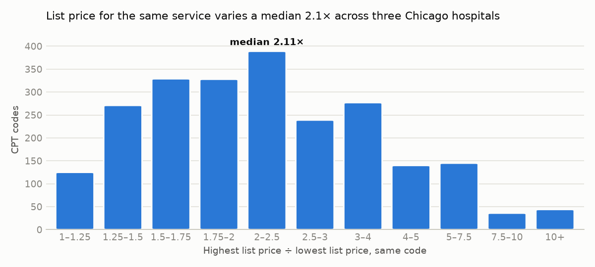
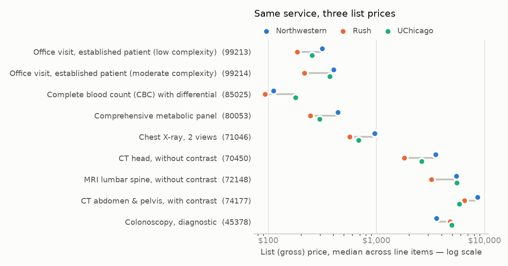
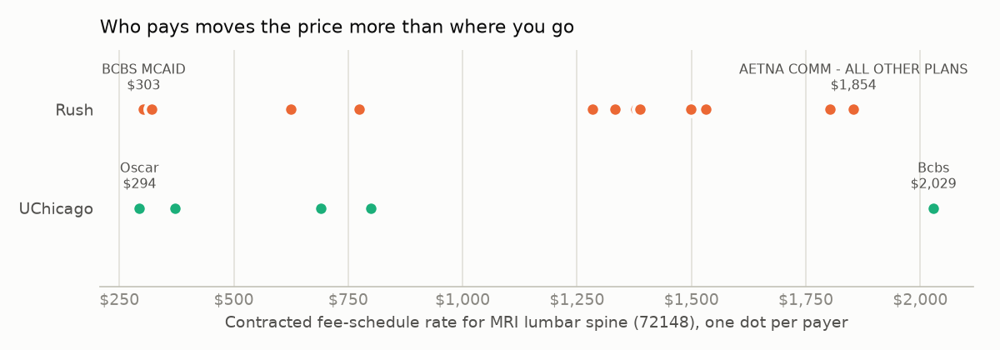

# Same code, different price: three Chicago hospitals

*A clear-pricer analysis. Every number below is computed by `clear-pricer analysis` from the public data release [`data-2026-09-29-27a34004`](https://github.com/tjromack/clear-pricer/releases/tag/data-2026-09-29-27a34004)
(fingerprint `27a340045c24de0f…`) — nothing is typed by hand; re-running reproduces this page.*

## Summary

- **List prices diverge.** For 2,323 outpatient CPT services priced by all three hospitals, the highest
  list (gross) price is a median **2.11×** the lowest; for one in ten codes it is **4.9×** or more.
- **Cash prices diverge more:** a median **3.38×** across the same 2,323 codes.
- **For insured patients, who pays moves the price more than where they go.** Across 2,709 services with
  contracted fee-schedule prices at both Rush and UChicago, the typical gap between the two hospitals is
  **1.55×** — but inside UChicago alone, the same service varies a median
  **4.1×** across its 6 payers. An MRI of the lumbar spine at UChicago: **$294** (Oscar) to **$2,029** (Bcbs).
- **Most "negotiated prices" in these files are not comparable prices.** Only a minority of published dollars are
  per-service contracted rates: Rush lists 39,354 rates *at the full list price*, almost all for Medicare
  Advantage plans;
  Northwestern's dollars are overwhelmingly percentages of list price, packages, or figures that don't reconcile.
  The comparison below is built on the subset that is genuinely like-for-like, and says so.

<picture><source media="(prefers-color-scheme: dark)" srcset="figures/list-price-ratio-dark.png"></picture>

## 1. What can be compared at all

A price file's "negotiated rate" column mixes several different things. Only per-service contracted rates
(`fee schedule` methodology, a dollar amount) are the same unit across hospitals. Charge rows by what the dollar
actually is:

| What the dollar is | Northwestern | Rush | UChicago |
|---|---|---|---|
| contracted fee schedule | 323 (0.0%) | 28,685 (13.8%) | 66,052 (48.3%) |
| package (case rate / per diem) | 3,817 (0.1%) | 16,805 (8.1%) | 0 (0.0%) |
| equals the list price | 0 (0.0%) | 39,354 (18.9%) | 0 (0.0%) |
| other contracted dollar (not fee schedule) | 0 (0.0%) | 49,498 (23.8%) | 0 (0.0%) |
| percent of list price | 2,699,583 (38.4%) | 68,877 (33.0%) | 0 (0.0%) |
| dollar and % disagree | 3,924,918 (55.9%) | 5,190 (2.5%) | 0 (0.0%) |
| no dollar published | 397,509 (5.7%) | 0 (0.0%) | 70,805 (51.7%) |

Three consequences shape everything below:

1. **Rush lists 39,354 rates at exactly the chargemaster price.** 39,116 of them (99%)
   belong to 7 Medicare Advantage plans with 5,588 rows each (AETNA MCR ADV, BCBS MCR ADV, CIGNA MCR ADV, DEVOTED MCR ADV - ALL PLANS, HUMANA MCR ADV - ALL OTHER PLANS, UHC MCR ADV, WELLCARE MCR ADV - ALL PLANS); the rest are
   scattered across 10 other payers. A negotiated rate equal to the list price is not a
   negotiated price; these rows are excluded from contracted comparisons.
2. **Northwestern publishes only 323 fee-schedule dollars (5 payers), and
   they don't behave like unit prices:** HB Venipuncture — **$0.01** against a list price of $1,361; HB N Block Inj Pudendal — **$1.58** against a list price of $31,577; HB Destruction Neurolytic Agt Genicular Nerve W/ — **$1.58** against a list price of $17,593. With no way to tell valid rows from artifacts inside the file,
   Northwestern is excluded from the contracted comparison (it stays in the list- and cash-price comparisons).
3. **Northwestern prices 2,124 whole surgical cases as items** (a local `CASE-` code). A case price
   is not a unit price, so those items are excluded everywhere below.

## 2. List prices: the same service, three prices

2,323 outpatient CPT codes carry a list (gross) price at all three hospitals. The ratio of the highest to
the lowest: p25 **1.64×** · median **2.11×** · p75 **3.18×** · p90 **4.93×**.
1,270 codes (55%) differ by 2× or more; 642
(28%) by 3× or more. No hospital is uniformly expensive: Northwestern Memorial highest on 735, lowest on 751; Rush University MC highest on 317, lowest on 1,153; UChicago Medical Center highest on 1,275, lowest on 412.

<picture><source media="(prefers-color-scheme: dark)" srcset="figures/basket-list-prices-dark.png"></picture>

| Service | List: NM | List: Rush | List: UChicago | Cash: NM | Cash: Rush | Cash: UChicago | Contracted: Rush | Contracted: UChicago |
|---|---|---|---|---|---|---|---|---|
| Office visit, established patient (low complexity) (`99213`) | $316 | $185 | $254 | $221 | $92.50 | $254 | $88.00 (1 payer) | $61.65 (1 payer) |
| Office visit, established patient (moderate complexity) (`99214`) | $402 | $215 | $370 | $281 | $108 | $370 | $88.00 (1 payer) | $85.14 (1 payer) |
| Complete blood count (CBC) with differential (`85025`) | $112 | $93.00 | $178 | $78.40 | $46.50 | $178 | $20.27 (12 payers) | $20.00 (6 payers) |
| Comprehensive metabolic panel (`80053`) | $438 | $245 | $298 | $307 | $122 | $298 | $25.05 (12 payers) | $27.18 (6 payers) |
| Chest X-ray, 2 views (`71046`) | $963 | $567 | $681 | $674 | $284 | $681 | $70.48 (8 payers) | $146 (6 payers) |
| CT head, without contrast (`70450`) | $3,535 | $1,803 | $2,610 | $2,474 | $902 | $2,610 | $518 (14 payers) | $327 (5 payers) |
| MRI lumbar spine, without contrast (`72148`) | $5,482 | $3,225 | $5,558 | $3,837 | $1,612 | $5,558 | $1,308 (14 payers) | $690 (5 payers) |
| CT abdomen & pelvis, with contrast (`74177`) | $8,642 | $6,486 | $5,839 | $6,049 | $3,243 | $5,839 | $664 (10 payers) | $1,104 (5 payers) |
| Colonoscopy, diagnostic (`45378`) | $3,607 | $4,777 | $4,970 | $2,525 | $2,388 | $4,970 | $1,237 (4 payers) | $1,296 (4 payers) |

*Contracted = median across payers of each payer's fee-schedule rate. "—" = not published as a comparable price.*

## 3. Cash prices

The discounted cash price — what the hospital says a self-paying patient is charged — varies more than the list
price: across the same 2,323 codes, p25 **2.43×** · median **3.38×** · p75
**5.01×** · p90 **7.84×**. Northwestern Memorial highest on 450, lowest on 472; Rush University MC highest on 53, lowest on 1,758; UChicago Medical Center highest on 1,820, lowest on 91.

Much of that is policy rather than price: the hospitals discount cash very differently. Northwestern Memorial's cash price is a median 70% of its list price; Rush University MC's cash price is a median 50% of its list price; UChicago Medical Center's cash price is a median 100% of its list price (identical to it on 100% of rows). A
self-paying patient's price depends as much on the hospital's cash policy as on its list price.

## 4. Contracted prices: between hospitals vs. between payers

**Between hospitals.** For 2,709 services with a fee-schedule rate at both Rush and UChicago, Rush's
payer-median rate is a median **0.78×** UChicago's (IQR 0.50–1.02) —
Rush is lower on most codes (higher on 749 of 2,709). The typical gap, whichever
side is higher: **1.55×**.

**Between payers, inside one hospital.** For services with at least three payers' rates:

| Hospital | Codes | Payers | Median spread (highest ÷ lowest payer) | 90th percentile |
|---|---|---|---|---|
| UChicago | 7,041 | 6 | **4.06×** | 8.75× |
| Rush | 2,751 | 32 | **1.16×** | 8.58× |

At UChicago, the payer a patient has moves the price of a typical service further than the choice between UChicago and
Rush does. Rush's contracts are much flatter across its payers — but its tail is as long as UChicago's.

<picture><source media="(prefers-color-scheme: dark)" srcset="figures/mri-payers-dark.png"></picture>

| Hospital | Payer | Contracted rate, MRI lumbar spine (72148) |
|---|---|---|
| Rush University MC | BCBS MCAID | $303 |
| Rush University MC | COUNTY CARE MCAID - ALL PLANS | $303 |
| Rush University MC | MERIDIAN MCAID - ALL OTHER PLANS | $303 |
| Rush University MC | MOLINA MCAID | $321 |
| Rush University MC | CIGNA ONE HEALTH | $625 |
| Rush University MC | BCBS EXCH/BCE | $775 |
| Rush University MC | AETNA INTERNATIONAL | $1,283 |
| Rush University MC | BCBS BCS | $1,333 |
| Rush University MC | UHC CORE/NAVIGATE | $1,379 |
| Rush University MC | BCBS BCO | $1,388 |
| Rush University MC | CIGNA COMM - ALL OTHER PLANS | $1,498 |
| Rush University MC | UHC ALL PAYER - ALL OTHER PLANS | $1,532 |
| Rush University MC | BCBS PPO - ALL OTHER PLANS | $1,802 |
| Rush University MC | AETNA COMM - ALL OTHER PLANS | $1,854 |
| UChicago Medical Center | Oscar | $294 |
| UChicago Medical Center | Ambetter | $371 |
| UChicago Medical Center | Unitedhealthcare | $690 |
| UChicago Medical Center | Aetna | $800 |
| UChicago Medical Center | Bcbs | $2,029 |

## Method

- **Source:** the clear-pricer data release named above: CMS machine-readable price files (template v3.0.0) for
  Northwestern Memorial, Rush University Medical Center and the University of Chicago Medical Center, parsed and gated
  by the pipeline (`DECISIONS.md` CP-DEC 005–008). Input file hashes are pinned in the release `manifest.json`.
- **Codes:** CPT Category I only, by *derived* code family (CP-DEC 006) — so CPT codes a hospital typed as `HCPCS` are
  included. Drug and supply codes (HCPCS Level II) are excluded: their units differ across files.
- **Setting:** outpatient, counting rows marked `both`.
- **Exclusions:** Northwestern's case-package items (`CASE-` local code); descriptions containing "unlisted".
- **Per hospital × code:** the median across its rows (a code often has several line items or payer rows). Contracted:
  the median across payers of each payer's median fee-schedule rate.
- **Ratios:** highest ÷ lowest across the hospitals that price the code (all three for list and cash; Rush and UChicago
  for contracted). Medians and percentiles are over codes, unweighted.

## Caveats

- **Three hospitals are not "the Chicago metro."** This is v1 of clear-pricer; the comparison is what these three files
  support. v2 extends it.
- **Prices, not volumes.** Every code counts once; a rarely billed code weighs as much as an office visit. No claims
  data is used.
- **List and cash prices are not what most patients pay.** Insured patients pay the contracted rate (plus their
  cost-sharing); list prices matter for uninsured patients and as the base that percentage contracts multiply.
- **Line items are not identical across hospitals.** One code can bundle different supplies, professional vs. facility
  components, or modifiers; medians reduce but do not remove this.
- **Publish dates differ:** Northwestern and UChicago published their files on 2026-04-01; Rush on 2026-09-25.
- **Northwestern's contracted prices are not compared**, for the reasons in section 1 — a limit of its file, stated
  rather than papered over.

## Reproduce

```bash
pip install -e ".[analysis]"   # duckdb + matplotlib
clear-pricer analysis --release data-2026-09-29-27a34004
```

The same numbers come out on any machine: the release is byte-reproducible (`DECISIONS.md` CP-DEC 014), and this
analysis reads it single-threaded in a fixed order.
